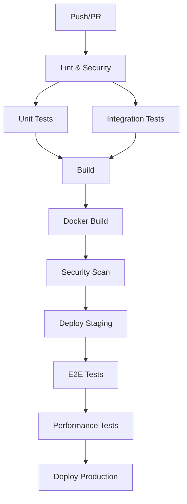

# 🧪 راهنمای جامع Testing

## فهرست مطالب
- [نصب و راه‌اندازی](#نصب-و-راه‌اندازی)
- [انواع تست‌ها](#انواع-تست‌ها)
- [اجرای تست‌ها](#اجرای-تست‌ها)
- [CI/CD Pipeline](#cicd-pipeline)
- [نوشتن تست جدید](#نوشتن-تست-جدید)
- [Coverage و کیفیت](#coverage-و-کیفیت)

---

## نصب و راه‌اندازی

### پیش‌نیازها
```bash
# نصب وابستگی‌های testing
npm run install:all

# راه‌اندازی دیتابیس تست
docker run -d --name mongo-test -p 27017:27017 mongo:6.0
docker run -d --name redis-test -p 6379:6379 redis:7-alpine
```

### تنظیم Environment Variables
```bash
# backend/.env.test
NODE_ENV=test
JWT_SECRET=test-jwt-secret-for-testing-purposes-only
JWT_REFRESH_SECRET=test-jwt-refresh-secret-for-testing-purposes-only
MONGODB_URI=mongodb://localhost:27017/exchange_test
REDIS_URL=redis://localhost:6379
BCRYPT_ROUNDS=4
```

---

## انواع تست‌ها

### 1. 🔬 Unit Tests
تست اجزای مجزای کد بدون وابستگی خارجی

**محل قرارگیری:**
- Backend: `src/tests/unit/`
- Frontend: `src/components/**/*.test.jsx`

**مثال:**
```javascript
// backend/src/tests/unit/auth.middleware.test.js
describe('Auth Middleware', () => {
  it('should authenticate valid JWT token', async () => {
    // Test implementation
  });
});
```

### 2. 🔗 Integration Tests
تست تعامل بین اجزای مختلف سیستم

**محل قرارگیری:**
- Backend: `src/tests/integration/`

**ویژگی‌های کلیدی:**
- ✅ Tenant Isolation
- ✅ Payment Processing
- ✅ Authentication Flow
- ✅ Database Operations

### 3. 🌐 E2E Tests
تست کامل User Journey از Frontend تا Backend

**ابزار:** Cypress
**محل قرارگیری:** `frontend/cypress/`

### 4. ⚡ Performance Tests
تست عملکرد و بار سیستم

**ابزار:** K6
**محل قرارگیری:** `scripts/performance-test.js`

### 5. 💨 Smoke Tests
تست‌های سریع پس از deployment

**محل قرارگیری:** `backend/scripts/smoke-tests.js`

---

## اجرای تست‌ها

### Backend Tests

```bash
cd backend

# همه تست‌ها
npm test

# فقط Unit Tests
npm run test:unit

# فقط Integration Tests
npm run test:integration

# تست با Coverage
npm run test:coverage

# تست در حالت Watch
npm run test:watch

# Smoke Tests
npm run test:smoke -- --env=staging
```

### Frontend Tests

```bash
cd frontend

# همه تست‌ها
npm test

# تست با UI
npm run test:ui

# تست در حالت Watch
npm run test:watch

# تست با Coverage
npm run test:coverage

# E2E Tests
npm run test:e2e

# E2E Tests Interactive
npm run test:e2e:open
```

### Performance Tests

```bash
# K6 Performance Test
k6 run scripts/performance-test.js

# با متغیرهای محیطی
k6 run -e BASE_URL=https://staging.example.com scripts/performance-test.js
```

---

## CI/CD Pipeline

### GitHub Actions Workflow

Pipeline شامل این مراحل است:



### مراحل Pipeline:

1. **🔍 Lint & Code Quality**
   - ESLint
   - Prettier
   - Code formatting check

2. **🔐 Security Audit**
   - npm audit
   - CodeQL analysis
   - Dependency vulnerability scan

3. **🧪 Unit Tests**
   - Backend unit tests با Coverage
   - Frontend unit tests با Coverage
   - Parallel execution

4. **🔗 Integration Tests**
   - Database integration
   - API integration
   - Tenant isolation tests

5. **🏗️ Build**
   - Backend build
   - Frontend build
   - Artifact upload

6. **🐳 Docker Build**
   - Multi-stage builds
   - Image optimization
   - Registry push

7. **🛡️ Security Scan**
   - Container vulnerability scan
   - SARIF reports

8. **🚀 Deploy**
   - Staging deployment
   - Production deployment (on release)
   - Health checks

9. **⚡ Performance Tests**
   - Load testing
   - Response time validation
   - Resource usage monitoring

### تنظیم Secrets

در GitHub Repository Settings → Secrets:

```
STAGING_HOST=staging.example.com
STAGING_USER=deploy
STAGING_SSH_KEY=<private-key>
STAGING_URL=https://staging.example.com

PRODUCTION_HOST=production.example.com
PRODUCTION_USER=deploy
PRODUCTION_SSH_KEY=<private-key>
PRODUCTION_URL=https://production.example.com

SLACK_WEBHOOK_URL=<webhook-url>
```

---

## نوشتن تست جدید

### 1. Unit Test برای Controller

```javascript
// backend/src/tests/unit/user.controller.test.js
const userController = require('../../controllers/user.controller');

describe('User Controller', () => {
  let req, res;

  beforeEach(() => {
    req = { body: {}, user: null };
    res = {
      status: jest.fn().mockReturnThis(),
      json: jest.fn()
    };
  });

  describe('createUser', () => {
    it('should create user successfully', async () => {
      req.body = {
        username: 'testuser',
        email: 'test@example.com',
        password: 'SecurePass@123'
      };

      await userController.createUser(req, res);

      expect(res.status).toHaveBeenCalledWith(201);
      expect(res.json).toHaveBeenCalledWith(
        expect.objectContaining({
          success: true,
          data: expect.any(Object)
        })
      );
    });
  });
});
```

### 2. Integration Test برای API

```javascript
// backend/src/tests/integration/user.integration.test.js
const request = require('supertest');
const app = require('../../server');

describe('User API Integration', () => {
  let authToken;

  beforeEach(async () => {
    // Setup authentication
    const authResponse = await request(app)
      .post('/api/auth/login')
      .send({
        email: 'admin@test.com',
        password: 'Admin@123'
      });
    
    authToken = authResponse.body.data.accessToken;
  });

  it('should create user with proper tenant isolation', async () => {
    const userData = {
      username: 'newuser',
      email: 'newuser@test.com',
      password: 'SecurePass@123'
    };

    const response = await request(app)
      .post('/api/users')
      .set('Authorization', `Bearer ${authToken}`)
      .send(userData);

    expect(response.status).toBe(201);
    expect(response.body.data.user.tenantId).toBeDefined();
  });
});
```

### 3. Frontend Component Test

```jsx
// frontend/src/components/UserForm.test.jsx
import { render, screen, fireEvent, waitFor } from '@testing-library/react';
import UserForm from './UserForm';

describe('UserForm', () => {
  it('should submit form with valid data', async () => {
    const mockOnSubmit = vi.fn();
    
    render(<UserForm onSubmit={mockOnSubmit} />);

    fireEvent.change(screen.getByLabelText(/نام کاربری/), {
      target: { value: 'testuser' }
    });
    
    fireEvent.change(screen.getByLabelText(/ایمیل/), {
      target: { value: 'test@example.com' }
    });

    fireEvent.click(screen.getByRole('button', { name: /ثبت/ }));

    await waitFor(() => {
      expect(mockOnSubmit).toHaveBeenCalledWith({
        username: 'testuser',
        email: 'test@example.com'
      });
    });
  });
});
```

### 4. Cypress E2E Test

```javascript
// frontend/cypress/e2e/login.cy.js
describe('Login Flow', () => {
  it('should login successfully with valid credentials', () => {
    cy.visit('/login');
    
    cy.get('[data-testid="email-input"]').type('admin@test.com');
    cy.get('[data-testid="password-input"]').type('Admin@123');
    cy.get('[data-testid="login-button"]').click();
    
    cy.url().should('include', '/dashboard');
    cy.get('[data-testid="user-menu"]').should('be.visible');
  });

  it('should show error for invalid credentials', () => {
    cy.visit('/login');
    
    cy.get('[data-testid="email-input"]').type('invalid@test.com');
    cy.get('[data-testid="password-input"]').type('wrongpassword');
    cy.get('[data-testid="login-button"]').click();
    
    cy.get('[data-testid="error-message"]').should('contain', 'اطلاعات نادرست');
  });
});
```

---

## Coverage و کیفیت

### Coverage Thresholds

**Backend:**
```javascript
// jest.config.js
coverageThreshold: {
  global: {
    branches: 70,
    functions: 70,
    lines: 70,
    statements: 70
  },
  // Critical modules
  './src/middleware/auth.js': {
    branches: 90,
    functions: 90,
    lines: 90,
    statements: 90
  }
}
```

**Frontend:**
```javascript
// vite.config.js
test: {
  coverage: {
    reporter: ['text', 'html', 'lcov'],
    thresholds: {
      global: {
        branches: 70,
        functions: 70,
        lines: 70,
        statements: 70
      }
    }
  }
}
```

### Quality Gates

در CI/CD Pipeline:

1. **Code Coverage** باید بالای 70% باشد
2. **Security Audit** نباید vulnerability های medium+ داشته باشد
3. **Lint Errors** باید صفر باشد
4. **Performance Tests** باید در threshold های تعریف شده باشند

### گزارش‌ها

```bash
# Coverage Report
npm run test:coverage

# Performance Report
npm run performance

# Security Report
npm run security:audit

# Code Quality Report
npm run lint
```

---

## بهترین شیوه‌ها

### 1. **Test Structure**
```javascript
describe('Feature/Component Name', () => {
  describe('Method/Function Name', () => {
    it('should do something specific', () => {
      // Arrange
      // Act
      // Assert
    });
  });
});
```

### 2. **Test Data**
```javascript
// استفاده از Factory Functions
const createTestUser = (overrides = {}) => ({
  username: 'testuser',
  email: 'test@example.com',
  role: 'customer',
  ...overrides
});
```

### 3. **Mocking**
```javascript
// Mock external dependencies
jest.mock('../services/emailService', () => ({
  sendEmail: jest.fn().mockResolvedValue({ success: true })
}));
```

### 4. **Test Environment**
```javascript
// Setup/Teardown
beforeEach(async () => {
  await setupTestDatabase();
});

afterEach(async () => {
  await cleanupTestData();
});
```

### 5. **Assertions**
```javascript
// Specific assertions
expect(response.status).toBe(200);
expect(response.body).toEqual(
  expect.objectContaining({
    success: true,
    data: expect.any(Object)
  })
);
```

---

## عیب‌یابی تست‌ها

### مشکلات رایج

1. **Test Timeout**
   ```javascript
   // افزایش timeout
   it('should handle long operation', async () => {
     // test code
   }, 10000); // 10 seconds
   ```

2. **Database Connection Issues**
   ```bash
   # بررسی اتصال دیتابیس
   docker ps | grep mongo
   docker logs mongo-test
   ```

3. **Memory Leaks**
   ```javascript
   // اطمینان از cleanup
   afterEach(() => {
     jest.clearAllMocks();
     cleanup();
   });
   ```

4. **Race Conditions**
   ```javascript
   // استفاده از waitFor
   await waitFor(() => {
     expect(element).toBeInTheDocument();
   });
   ```

### Debug Mode

```bash
# Backend tests با debug
npm test -- --verbose --detectOpenHandles

# Frontend tests با debug
npm run test:watch

# E2E tests با debug
npm run test:e2e:open
```

---

## نظارت و Monitoring

### Test Metrics

- **Test Execution Time**
- **Coverage Percentage**
- **Flaky Test Detection**
- **Test Failure Rate**

### Performance Monitoring

```javascript
// K6 Custom Metrics
import { Trend, Rate } from 'k6/metrics';

const apiResponseTime = new Trend('api_response_time');
const errorRate = new Rate('error_rate');
```

### Reporting

```bash
# Generate comprehensive test report
npm run test:coverage && npm run test:e2e && npm run performance
```

---

**نکته مهم**: همیشه تست‌ها را قبل از commit اجرا کنید و مطمئن شوید Coverage کافی دارید. 

Pipeline خودکار است اما local testing همیشه سریع‌تر و مؤثرتر است.
